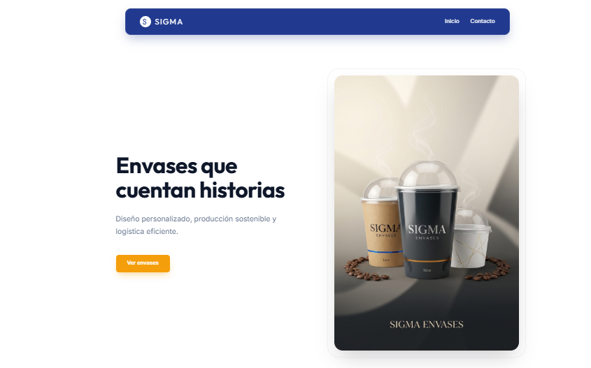

# ⚡ Sigma — Envases & Publicidad Creativa

> **Dos mundos, una misma excelencia.**  
> Sigma es una plataforma integral que une el diseño de envases sostenibles con estrategias de publicidad creativa para potenciar tu marca.

---

## 📸 Vista previa

| Hub Principal | Sección Envases | Sección Publicidad |
| :---: | :---: | :---: |
|  |  |  |

---

## 🧩 Características

- ✅ **Diseño moderno y responsivo** — Adaptado a móviles, tablets y escritorio.
- ✅ **Navegación SPA** — Transiciones suaves entre secciones sin recargar la página.
- ✅ **Panel de Envases** — Catálogo de productos, servicios y FAQ interactivo.
- ✅ **Panel de Publicidad** — Estrategias creativas y casos de éxito.
- ✅ **Contacto** — Mapa interactivo, datos de ubicación y acceso directo a WhatsApp.
- ✅ **Backend con Express** — Servidor Node.js listo para escalar.
- ✅ **Listo para producción** — Estructura optimizada para despliegue en Render, Railway o Vercel.

---

## 🛠️ Stack Tecnológico

| Tecnología | Uso |
| :--- | :--- |
| **HTML5** | Estructura semántica del sitio |
| **CSS3** | Estilos y animaciones (variables CSS, Grid, Flexbox) |
| **JavaScript (Vanilla)** | Lógica del frontend (navegación, acordeón, scroll) |
| **Node.js + Express** | Servidor backend y enrutamiento |
| **Git & GitHub** | Control de versiones y repositorio remoto |

---

## 📁 Estructura del Proyecto
Sigma/
├── public/

│ ├── imagenes/

│ ├── index.html

│ ├── index.js

│ └── styles.css

├── server.js

├── package.json

├── package-lock.json

├── .gitignore

└── README.md

---

## ⚙️ Instalación y Uso Local

Sigue estos pasos para correr el proyecto en tu máquina:

# 1. Clonar el repositorio
git clone https://github.com/tu-usuario/sigma.git
cd sigma

# 2. Instalar dependencias
npm install

# 3. Ejecutar el servidor en modo desarrollo
npm run dev

# 4. Abrir en el navegador
http://localhost:3000

 # 🚢 Despliegue en Producción
Puedes desplegar este proyecto en servicios como:

Render — Sube tu repositorio y Render lo despliega automáticamente.

Railway — Similar a Render, muy sencillo.

Vercel — Ideal si quieres separar frontend y backend.

 # 🤝 Contribuciones
¿Quieres mejorar Sigma? ¡Eres bienvenido!

Haz un fork del proyecto.

Crea una rama: git checkout -b feature/nueva-funcionalidad

Haz commit de tus cambios: git commit -m 'Agrega nueva funcionalidad'

Sube tu rama: git push origin feature/nueva-funcionalidad

Abre un Pull Request.

 # 📄 Licencia
Este proyecto está bajo la licencia MIT.
Puedes usarlo, modificarlo y distribuirlo libremente.

 #  📬 Contacto
¿Tienes preguntas o sugerencias?

📧 Email: info@sigmaenvases.com

📱 WhatsApp: +58 412 123 45 67

🌐 Web: www.sigmaenvases.com

# Hecho con 💛 por Ángel Leal, Francisco Munive y el equipo Sigma.
